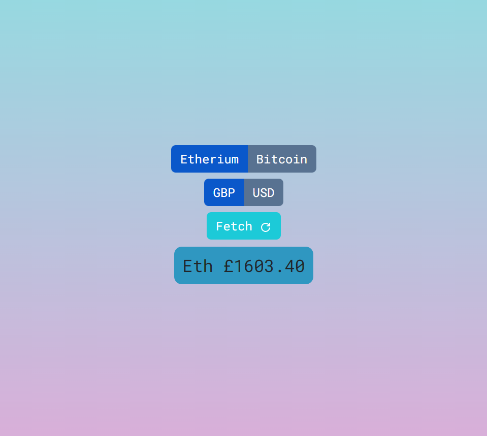

# price-widget

price-widget - [Github Repo](https://github.com/Ryocon/price-widget)
 
Deployed - [Render](https://coin-widget.onrender.com/)

  ## Table of Contents
  - [Description](#description)
  - [Installation](#installation)
  - [Screenshots](#screenshots)
  - [Challenges](#challenges)
  - [Future Developments](#future)
  - [Tests](#tests)
  - [License](#license)
  - [Credits](#credits)
  - [Questions](#questions)
  

  ## Description
  This project is a price checking widget for Etherium and Bitcoin for both GBP and USD currencies. It uses the Coinpaprika API to pull current prices and displays them based on user input. Localstorage is utilised to remember previous prices serached by the user. A 'fetch' button refreshes the price at anytime and is used to also pull from the API. Vite was used for intialisation and Render was used to deploy and host the project.

  ## Installation
  This project does not require installation and is hosted on Render.

  ## Screenshots
  

  ## Challenges
  I currently don't have many completed React projects under my belt so this was a fun lesson in using state and useEffect productively for API calls. I did at one point send over 10k calls in about 20 seconds which was interesting to watch. The API limit also hindered testing but other than that it was a case of making sure I got API data set in states and passed from parent to child in my file structure which were the most challenging aspects.

  ## Future Developments
  I would move away from using Bootstrap as although the components it provides I do find limiting when it comes to customising them. I would like to spend more time styling as it currently is very basic and I would like to push the design further.
  Options to pull more data from the API and display the data as a chart would also be something to think about in the future.

  ## License
  This project uses the MIT license.

  ## Credits
  There were no additional collaborators for this project.

  ## Tests
  There are no tests available for this project.

  ## Questions
  For any questions please contact via Github or email.

  Github - https://github.com/Ryocon

  Email - roconn25@gmail.com